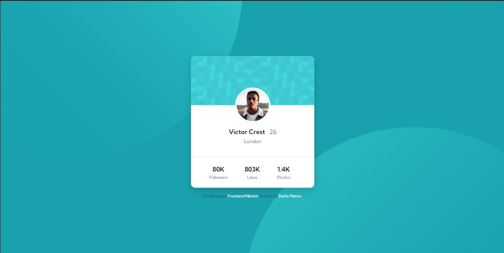
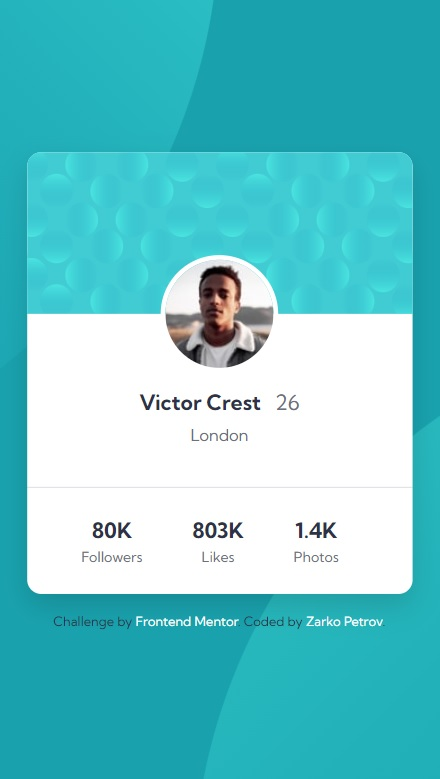

# Frontend Mentor - Profile card component solution

This is a solution to the [Profile card component challenge on Frontend Mentor](https://www.frontendmentor.io/challenges/profile-card-component-cfArpWshJ). Frontend Mentor challenges help you improve your coding skills by building realistic projects.

## Table of contents

- [Overview](#overview)
  - [The challenge](#the-challenge)
  - [Screenshot](#screenshot)
  - [Links](#links)
- [My process](#my-process)
  - [Built with](#built-with)
  - [What I learned](#what-i-learned)
  - [Continued development](#continued-development)
- [Author](#author)

## Overview

### The challenge

- Build out the project to the designs provided

### Screenshot




### Links

- [Solution URL](https://your-solution-url.com)
- [Live site URL here](https://zp021-frontend-mentor-profile-card.netlify.app/)

## My process

### Built with

- Semantic HTML5 markup
- CSS custom properties
- Flexbox
- Mobile-first workflow

### What I learned

After initally trying to set the position of each background patter svg, I opted for using background image, then setting the background position.

```css
body {
  background-image: url("../images/bg-pattern-bottom.svg"),
    url("../images/bg-pattern-top.svg");
  background-position: left 44vw top 40vh, right 50vw bottom 37vh;
  background-repeat: no-repeat;
  background-color: var(--clr-background);
}
```

### Continued development

It took me longer than expectrd to finish this project, so I will defenitely go back and to it again to solidify the concepts used in this cahllenge.

## Author

- Frontend Mentor - [@zp021](https://www.frontendmentor.io/profile/zp021)
- GitHub - [@zp021](https://github.com/zp021)
